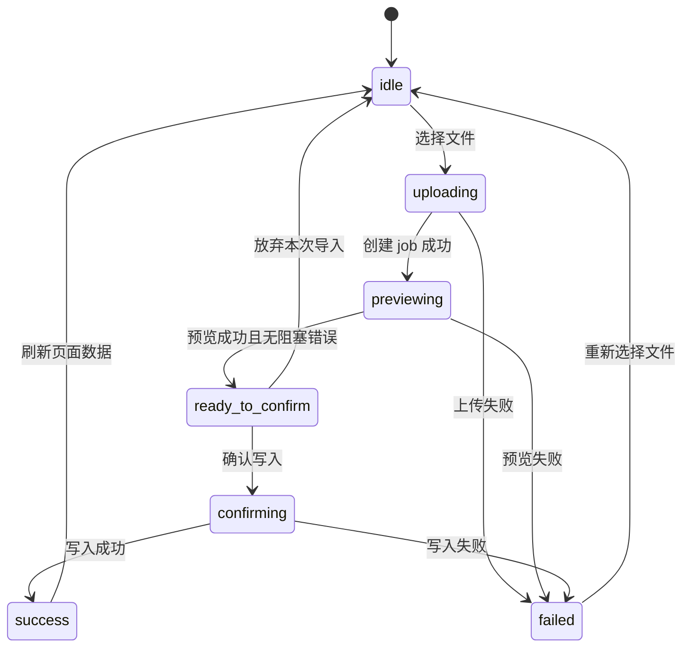

# 地市报表上传重建设计

## 设计目标

将地市 Web 上传从“按钮触发的一组松散请求”重建为“导入作业状态机”。后端以 `import_jobs` 为唯一事实源；前端只围绕当前作业状态展示上传、预览、确认、失败与刷新。

## UI 设计规格

1. Purpose Statement：上传区服务于地市用户的高风险数据写入场景，界面必须让用户清楚知道当前文件处于上传、预览、待确认还是失败状态。设计重点是可解释、可追踪、避免误点。
2. Aesthetic Direction：Industrial / utilitarian。使用业务系统式的稳健布局，突出流程状态、证据编号和错误摘要。
3. Color Palette：沿用现有 Ant Design/后台系统品牌约束：导航深色 `#001529`，主按钮蓝 `#1677FF`，成功 `#52C41A`，警告 `#FAAD14`，错误 `#FF4D4F`，背景 `#F5F7FA`。
4. Typography：沿用现有 Admin Web 字体体系与 Ant Design 组件规范。这里明确覆盖通用 UI 设计默认限制，因为项目已上线且视觉一致性优先。
5. Layout Strategy：上传区域改为横向流程向导：左侧文件入口，中间作业状态，右侧预览摘要/操作按钮。错误详情折叠在下方，避免挤占合同填报主表。

## 总体流程



## 后端设计

### 模块边界

- 新建或重构 `CityImportJobsController`，专门服务地市端导入。
- 保留 `Ws6Service` 中通用解析/确认能力，但将权限校验和作业上下文收敛到一处。
- 旧 `CityImportsController` 和通用 `/imports/:jobId/*` 地市调用路径逐步退场；上线初期可保留兼容，但新页面只走新接口。

### API

建议新接口：

```text
POST   /api/city/import-jobs
GET    /api/city/import-jobs/:jobId
GET    /api/city/import-jobs/:jobId/preview
POST   /api/city/import-jobs/:jobId/confirm
POST   /api/city/import-jobs/:jobId/cancel
```

`POST /api/city/import-jobs` 使用 multipart：

```text
file: File
jobType: city_reporting | city_cost
reportYear: number
```

返回：

```json
{
  "jobId": 123,
  "status": "pending",
  "jobType": "city_reporting",
  "operatorUserId": 8,
  "cityId": 1,
  "reportYear": 2026,
  "filename": "report.xlsx"
}
```

### 数据模型

在现有 `import_jobs` 基础上补齐字段，不做破坏性重建：

- `report_year INT NULL`
- `job_type VARCHAR(32) NOT NULL`
- `operator_user_id BIGINT NOT NULL`
- `city_id BIGINT NULL`
- `status VARCHAR(32) NOT NULL`
- `source_file_name VARCHAR(255) NULL`
- `source_file_base64 LONGTEXT/TEXT NULL`
- `parsed_summary_json JSON NULL`
- `diff_summary_json JSON NULL`
- `error_summary_json JSON NULL`
- `confirmed_at DATETIME NULL`

建议索引：

```sql
CREATE INDEX idx_import_jobs_owner ON import_jobs(operator_user_id, created_at);
CREATE INDEX idx_import_jobs_city_year_type ON import_jobs(city_id, report_year, job_type, created_at);
```

状态建议：

- `pending`：文件已保存，尚未预览完成。
- `previewed`：解析预览完成，可确认或提示错误。
- `completed`：已确认写入。
- `failed`：上传、预览或确认失败。
- `cancelled`：用户放弃。

### 权限规则

地市端所有导入接口统一执行：

```text
user.role 必须为 city_user
job.operator_user_id 必须等于 user.userId
job.city_id 必须等于 user.cityId
job.job_type 必须为 city_reporting 或 city_cost
```

管理员端如需访问，应使用独立 admin 接口，不复用地市接口绕权限。

## 前端设计

### 新组件

建议替换 `CityImportPanel` 为：

```text
CityImportWizard
CityImportStatusBar
CityImportPreviewSummary
CityImportErrorPanel
```

### 前端状态

```ts
type ImportWizardState =
  | 'idle'
  | 'uploading'
  | 'previewing'
  | 'ready_to_confirm'
  | 'confirming'
  | 'success'
  | 'failed';
```

前端保存：

- `currentJobId`
- `currentJobFingerprint = userId + cityId + reportYear + mode + jobId`
- `preview`
- `error`
- `selectedFileName`

任一上下文变化时清空：

- 登录用户变化
- 年份变化
- 月份变化
- `mode` 报表/成本变化
- 上传失败
- 预览失败
- 确认完成

### API client

上传、预览、确认必须统一走同一套 client。不要再出现上传用独立 `fetch`、预览/确认用 `axios` 的分裂。

可选实现：

- 在 `utils/request.ts` 增加 `postForm` 封装。
- 或在 `ws6.api.ts` 内复用同一 token/base/error 处理函数，但不重复维护两套逻辑。

## 迁移策略

1. 先上线新接口和新前端组件。
2. 旧接口保留一个版本周期，只做兼容，不再被新前端调用。
3. 新闭环验证通过后，再删除旧 `CityImportPanel` 和旧地市上传 API。
4. 不删除历史 `import_jobs` 数据。

## 测试策略

必须覆盖：

- 地市用户上传报表成功。
- 地市用户上传成本成功。
- 上传后立即预览，`operator_user_id = /api/me.id`。
- 切换年份后旧 `jobId` 不可确认。
- 预览失败后确认按钮禁用。
- 访问他人 `jobId` 返回 403。
- 确认写入成功后页面数据刷新。
- 线上 Web 部署后真实地市账号冒烟。

