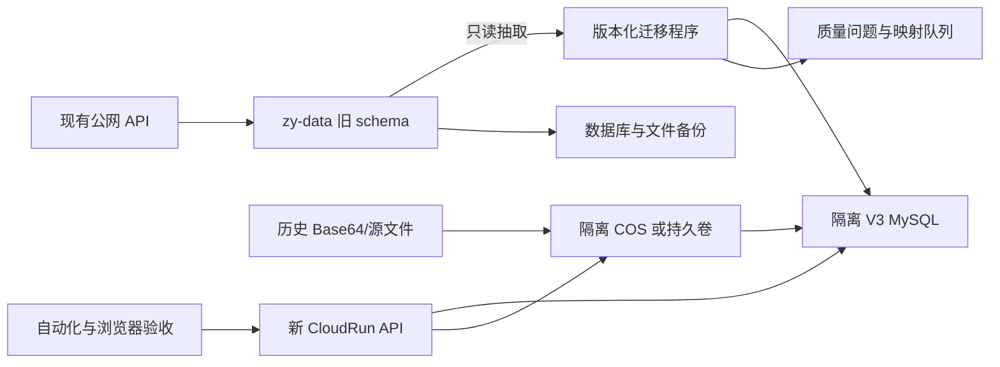
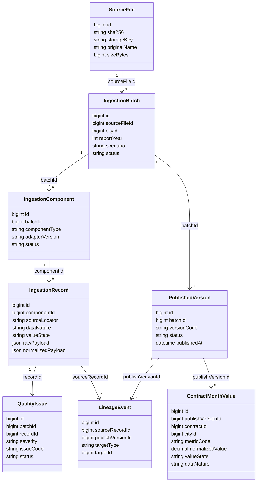

# 数据库架构 V3 设计与迁移方案

> 状态：设计完成，执行待确认  
> 对应需求：`specs/database-architecture-v3/requirements.md`  
> 日期：2026-07-30

## 1. 决策摘要

采用“单一 MySQL 目标库 + 对象存储 + 模块化单体 + 蓝绿迁移”。当前 `zy-data` schema 只作为只读迁移来源；新目标库从空库执行 001-007，再通过 008+ 补齐完整数据中台结构，完成数据迁移和验收后切换新 CloudRun。

不选择原地修补的原因：

- 当前表集合虽接近 001-004，但没有迁移账本。
- `users.cityId`、`_openid`、缺失唯一键/外键等结构与 001 不一致。
- 005-007 完全未落库，当前 API 与线上 schema 不兼容。
- 79 条月度孤儿记录使直接补外键不可行。
- 原地迁移失败会同时影响现有公网服务和历史数据。

## 2. 部署拓扑

切换前两个系统完全隔离。切换仅改变新前端/API 的连接目标，不在旧 schema 上执行结构升级。

## 3. 目标逻辑分层

| 层 | 核心对象 | 说明 |
|---|---|---|
| 主数据 | `cities`、`users`、`contracts`、`contract_city_allocations`、`contract_aliases` | 地市、账号、合同、分配和别名 |
| 接入 | `source_files`、`ingestion_batches`、`ingestion_components`、`ingestion_records` | 文件、根批次、子数据集和来源行 |
| 治理 | `quality_issues`、`mapping_resolutions`、`metric_definitions` | 质量、人工映射、公式版本 |
| 发布 | `published_versions`、`published_snapshots`、`lineage_events` | 正式生效版本、快照和血缘 |
| 事实 | `cost_facts`、`order_facts`、`contract_month_values`、`city_driver_month_values`、`maintenance_contract_snapshots` | 强类型事实和同构月度指标 |
| 审计 | `fact_versions`、`operation_logs` | 行级变化与操作记录 |

## 4. 核心关系模型

## 5. 建模原则

### 5.1 混合强类型模型

- 成本、订单继续使用 `cost_facts`、`order_facts` 强类型宽表。
- 完工、审定、开票等结构相同的合同月度指标使用 `contract_month_values` 长表。
- 原始、标准化中间载荷可使用 JSON，但正式核心事实不能只存在 JSON 中。

### 5.2 发布版本与行版本分离

- `published_versions` 表示一个数据集何时正式生效。
- `fact_versions` 表示单条事实如何创建、修改或冲销。
- 查询当前数据时通过正式发布版本选择，不使用无约束的 `MAX(version_no)` 猜测当前版本。

### 5.3 值语义

标准数值至少保存：

- `raw_value`、`normalized_value`。
- `value_state`：missing、reported_zero、reported_value、derived_zero、not_applicable、parse_error。
- `data_nature`：actual、forecast、assumption、derived。
- 原始/标准单位、换算因子、年度、月份、截止月份和场景。

### 5.4 对象存储

- 新文件只写 COS 或固定持久卷。
- MySQL 保存 storage key、SHA-256、大小、MIME、上传者和时间。
- 历史 Base64 在上传并校验成功前保持原样；完成观察期后通过新增迁移停止使用，不原地删除旧迁移列。

## 6. 迁移序列

### Stage A：冻结与备份

1. 冻结发布候选 commit 和迁移 checksum。
2. 导出旧 schema DDL、表级数量、聚合金额、权限和结构哈希。
3. 完成数据库备份和历史文件备份，并执行一次恢复演练。

### Stage B：建立隔离目标库

1. 创建明确标记 isolated 的 CloudBase 环境或专用 schema。
2. 使用非 root 专用账号和最小权限。
3. 从空库执行 001-007，确认 8 行账本、007 结构和幂等。
4. 不允许 `DB_SYNC=true`。

### Stage C：008+ 目标结构

建议新增迁移顺序：

- `008_ingestion_publication_foundation`：source files、root batches、components、records、quality、published versions、lineage。
- `009_master_data_and_metric_versions`：合同别名、年度计划、合同月度值、驱动值、综合代维快照、指标定义。
- `010_legacy_migration_tracking`：迁移批次、源主键映射、对账结果和兼容视图。
- 后续迁移只做经验证的增量修正，不修改 001-010。

### Stage D：主数据与账号迁移

迁移顺序：cities -> users -> contracts -> allocations -> configs。

- 尽量保留旧 ID。
- `cityId` 显式映射为 `city_id`。
- 保留 openid；`_openid` 是否保留取决于新表是否允许客户端直连。
- 现有 `system_admin` 不自动升级；由项目负责人书面指定唯一 `root_admin`。
- 其余角色按业务确认创建或映射。

### Stage E：报表与事实迁移

- `annual_report_packages` 转换为迁移来源批次和发布版本。
- 合同月度行转换为 `contract_month_values`，保留快照编码和名称作为来源证据。
- 79 条孤儿记录进入合同映射；未确认记录不得发布。
- 旧成本月度数据先识别实际/预测属性，再选择 `cost_facts` 或计划值资产。
- 订单实际优先来自订单源文件和 `order_facts`，不得用旧月度汇总冒充行级事实。
- 2 条孤儿日志保留 legacy actor 标识，不建立虚假用户关系。

### Stage F：应用切换

1. 新 CloudRun 仅连接隔离 V3 数据库和隔离存储。
2. 完成迁移、认证、RBAC、跨地市、导出和浏览器验收。
3. 进行影子查询和新旧结果对账。
4. 经授权后切换前端/API 入口。
5. 旧 API 和旧 schema 进入只读观察期。

## 7. 约束和索引策略

- 所有核心表使用 InnoDB、`utf8mb4_unicode_ci`。
- 金额使用 `DECIMAL(18,2)`，费率使用明确精度，禁止浮点。
- 月份使用 1-12 检查规则或应用+数据库双校验。
- 主数据采用软删除；正式事实不级联删除。
- 高频索引以 `city_id + period_year + period_month` 为主，辅以 contract、batch、publish version。
- 唯一键必须建立在稳定业务键和版本范围上。
- JSON 仅作证据或扩展载荷；常用过滤字段必须结构化并建立索引。

## 8. 权限方案

- 数据库账号：migration、application、readonly-audit 分离。
- 应用账号不得拥有 DROP、CREATE USER、GRANT 等权限。
- 新业务表 CloudBase ACL 默认 `ADMINONLY`，由 NestJS API 统一访问。
- `city_user` 地市范围由 JWT、Guard 和 repository 查询共同约束。
- `system_admin`、`contract_manager` 跨地市操作进入 `operation_logs`。
- 公网数据库访问仅在迁移窗口按白名单临时开放；CloudRun 稳定使用 VPC 后关闭或收紧。

## 9. 对账与验收

必须同时验证：

- 表、列、索引、外键、字符集和迁移 checksum。
- 各地市/年度/合同的行数和金额总计。
- 空白、零、负数、冲销和未映射记录数量。
- 文件 SHA-256、storage key 和下载恢复。
- 四角色权限、旧 JWT 失效、跨地市拒绝。
- 新旧 Dashboard、测算和导出结果。
- 备份恢复和流量回切。

## 10. 回滚策略

- schema 变更不通过反向 DDL 回滚生产数据。
- 切换失败时回切旧 API 和旧只读 schema。
- 新库保留失败批次、日志和证据用于修复后重放。
- 只有新系统通过观察期后，才另行批准旧资源归档。
