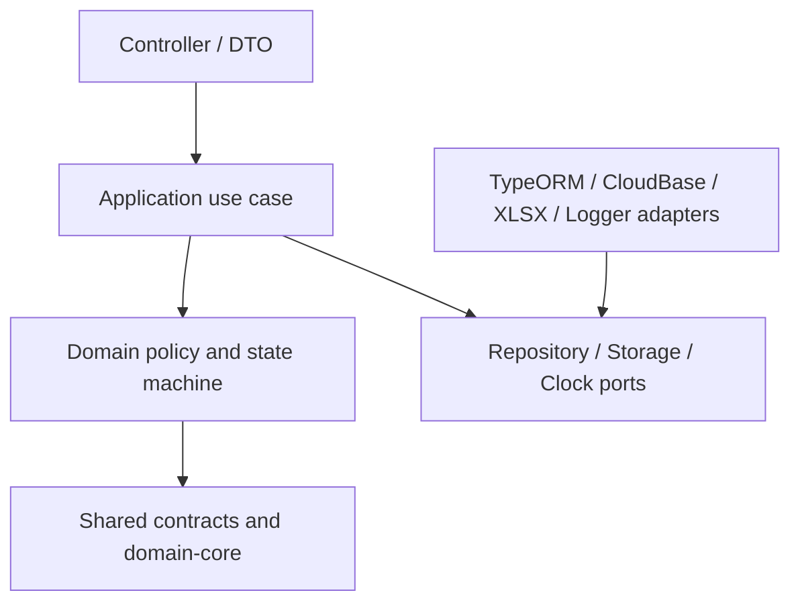

# 经营数据中台软件架构优化设计

> 状态：当前权威软件架构设计  
> 对应需求：`specs/larkmidtable-architecture-optimization/requirements.md`  
> 生效日期：2026-07-25

## 1. 设计目标

本设计将当前项目收敛为可渐进演进的模块化单体。目标不是复制外部项目的目录，而是让业务用例、领域规则、基础设施、前端 feature 和共享契约有稳定边界，使经营测算包的接入与发布可以独立演进。

## 2. 当前基线与迁移原则

只读审计确认以下事实：

- 根 `AppModule` 仍承担城市和管理员种子初始化。
- `packages.service.ts`、`ws6.service.ts` 和导入服务承载多个无关用例。
- 新旧地市导入接口并存。
- 前端已有统一 request client 和局部导入状态机，但路由、页面和 feature 尚未系统分层。
- `shared-types/src` 混有源码和生成物。
- 仓库根目录存在部署、备份、日志和临时产物混放风险。

迁移遵循“先加边界和测试，再迁移一条业务切片，最后退役兼容层”。不在同一任务中同时移动目录、改变业务语义、执行生产迁移和部署。

## 3. 目标仓库拓扑

```text
apps/
  api/
    src/
      bootstrap/              # 启动、seed、migration runner
      modules/
        identity/
        contracts/
        reporting/
        ingestion/
        governance/
        metrics/
      platform/               # TypeORM、storage、config、logging adapters
      app.module.ts
  admin-web/
    src/
      app/                    # 路由、providers、布局装配
      features/               # ingestion、quality、contracts、reporting
      api/                    # 基于共享契约的 client
      shared/                 # 通用组件、hooks、utils
packages/
  shared-types/               # DTO、枚举、错误、API 契约，仅 TS 源码
  shared-constants/           # 跨端常量
  domain-core/                # 可选：无 I/O 的指标、状态和值语义
docs/
specs/
scripts/
sql/
archives/                     # 经确认后归档，不作为本轮强制搬迁
```

`domain-core` 只有在同一领域规则被 API、Web、小程序或测试复用时创建；禁止为了目录对称而拆包。

## 4. 后端分层与依赖方向



规则：

- Controller 处理协议、认证、参数校验和响应映射；不拼装跨表业务规则。
- Application service 编排“创建批次、解析、预览、发布、撤销”等用例，并控制事务边界。
- Domain 表达值状态、单位、期间、质量策略、指标计算和状态机；不得直接导入 TypeORM、HTTP、文件系统或 CloudBase SDK。
- Repository/storage port 由领域或应用定义；infrastructure 实现其接口。
- Entity 是持久化映射，不承担跨模块决策。

### 4.1 目标模块职责

| 模块 | 应用用例 | 领域责任 | 禁止责任 |
| --- | --- | --- | --- |
| `ingestion` | 接收、解析、预览、发布、取消 | 批次状态、组件边界 | Dashboard 公式、页面路由 |
| `governance` | 合同映射、质量处置、血缘查询 | 映射决策、质量级别 | 直接解析 Excel |
| `contracts` | 主合同和分配维护 | 合同身份和别名规则 | 地市文件发布流程 |
| `reporting` | 手工草稿、月度提交、兼容读取 | 月度值和快照规则 | 模板猜测 |
| `metrics` | 指标查询和重算 | 公式版本、单位、舍入 | 文件上传和 DB 配置 |
| `identity` | 登录、角色、范围 | 身份和权限策略 | 业务数据计算 |

## 5. 接入适配器架构

```text
IngestionApplicationService
  -> SourceFilePort
  -> TemplateRegistry
      -> OperatingEstimateWorkbookV1Adapter
      -> FutureExternalApiAdapter
  -> NormalizationPolicy
  -> QualityPolicy
  -> PublicationService
```

适配器只负责来源签名、解析、来源定位和标准候选记录。`PublicationService` 是唯一允许把通过校验的候选记录转换为发布版本的用例。旧 `/imports`、`/city/imports` 与新接口先通过兼容 adapter 接入同一应用用例，待调用监控和回归满足条件后退役。

## 6. 前端架构

```text
app/
  routes.tsx
  providers.tsx
  layouts/
features/
  ingestion/                 # upload, batch detail, preview, publish
  quality/                   # issue list, resolution
  reporting/                 # manual reporting and published views
  contracts/                 # master data and mapping
  metrics/                   # dashboards and estimates
api/
  ingestion.api.ts
  quality.api.ts
shared/
  auth/
  request/
  components/
  hooks/
```

页面只组合 feature。上传 feature 必须使用统一 client、认证上下文和批次状态机；用户、地市、年度、场景、文件或组件切换时重置旧 batch context。菜单、路由和角色访问由集中配置驱动。

## 7. 共享契约与领域核心

`packages/shared-types` 应定义：

- API DTO、分页、错误码和可序列化枚举。
- `BatchStatus`、`ComponentStatus`、`DataNature`、`ValueState`、`QualitySeverity`、`PublishStatus`。
- 批次预览、质量问题、发布版本、血缘和指标查询契约。

`packages/domain-core` 若创建，应只包含：

- 值状态与单位转换规则。
- 批次和发布状态机。
- 指标公式及其版本测试夹具。
- 无 I/O 的合同编码规范化和匹配评分。

它不得输出框架装饰器、实体、环境配置或浏览器存储代码。

## 8. 启动、配置与可观测性

### 8.1 启动

`AppModule` 仅装配模块、全局 Config、数据库连接和全局 Guard。种子与迁移改为显式命令或 `bootstrap` 服务；启动时不根据“表是否为空”隐式改变生产数据。

### 8.2 配置

集中校验 `DB_*`、对象存储、JWT、上传限制、模板白名单和日志配置。业务模块接收类型化配置端口，不散落 `process.env` 分支。

### 8.3 观测

所有批次日志、指标和错误至少带：`batchId`、`componentId`、`cityId`、`actorUserId`、`adapterVersion`、`publishVersion`。关键指标包括解析耗时、阻塞问题数、发布成功率、重复提交数、旧路由调用量和新旧对账差异。

## 9. 仓库与归档

- 生成物输出到 `dist/`，不提交或混入 `src/`。
- SQL 分为受控迁移、只读核查和一次性脚本；一次性脚本必须声明输入、风险和回滚。
- 部署包、下载包、备份、日志和临时 SQLite 归档前先做所有者、用途和引用调查。
- 文档使用权威头部和历史状态头部，避免旧文件重新声明目标。
- 移动目录前提供迁移表：旧路径、新路径、调用方、兼容期、删除条件。

## 10. 架构守卫与测试

根工作区应提供：

```text
pnpm typecheck
pnpm test:unit
pnpm test:integration
pnpm test:architecture
pnpm build
```

命令可以逐步补齐，但不能用不存在的脚本宣称通过。架构检查至少验证：

- domain 不依赖 controller、TypeORM、CloudBase 或浏览器 API。
- feature 页面不直接调用 `fetch` 或读取 token。
- 生成物不位于共享包 `src/`。
- 已退役路由没有新调用方。
- DTO 和状态枚举只从共享契约包导入。

## 11. 渐进迁移切片

1. 提取值状态、批次状态和错误契约到共享包，并补测试。
2. 新增 `ingestion` 模块和影子适配器，不改正式写入。
3. 将地市上传新路径转接到根批次用例，保留兼容 controller。
4. 迁移合同映射、质量和发布服务。
5. 将前端上传向导迁移为 `features/ingestion`，并以新预览 API 替换旧 job API。
6. 将看板、导出、小程序读取收敛到已发布数据服务。
7. 在监控和回归通过后退役旧路由和遗留 service 分支。

每一切片独立构建、测试、回滚；任何切片都不得因目录移动掩盖字段语义变化。

## 12. 需求追踪

| 设计章节 | 对应需求 |
| --- | --- |
| 2-3 基线与仓库拓扑 | AR-R1、AR-R8 |
| 4 后端分层 | AR-R2 |
| 5 接入适配器 | AR-R3 |
| 6 前端架构 | AR-R5 |
| 7 共享契约 | AR-R4 |
| 8 配置与观测 | AR-R7 |
| 9-11 守卫、测试与迁移 | AR-R6、AR-R8 |

