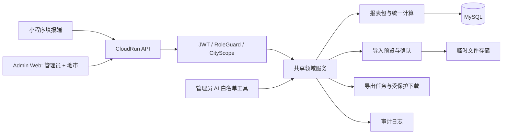

# 经营单元上报系统 OA 化设计

> 状态：历史设计。本文保留为 OA 化阶段快照，已被 `specs/operating-data-platform/` 吸收。后续设计以经营数据中台总纲为准。

## 1. 设计原则

- 复用 `apps/api` CloudRun NestJS 服务、`apps/admin-web` React 应用和现有 MySQL。
- 小程序与 Web 只通过统一 API 访问业务数据；前端不连接数据库。
- 权限在 Controller 守卫和 Service 资源校验两层执行。
- 领域公式只保留一份，提交预览、快照、总览、测算和导出全部调用同一服务。
- 所有数据库变更采用增量迁移，先预发布验证，不直接改生产库。

## 2. 架构



认证上下文统一为：

```ts
type ScopeContext = {
  userId: number;
  role: 'system_admin' | 'city_user';
  cityId: number | null;
  allowedCityIds: number[] | 'all';
};
```

建议新增 `@RequireRoles(...)`、`@CityScoped()` 和 `ScopeService`。Service 层所有 `packageId`、`jobId`、`contractId` 都必须先解析资源所属城市，再与 scope 比较。

## 3. 领域与公式

新增或抽取 `ReportingCalculationService`，统一提供：

- 月度输入校验和金额归一化。
- 完工、审定、开票、订单、成本和综合代维汇总。
- 订单毛利、毛利率、成本率、成本收入率、净利润和净利率。
- 提交预览和月快照生成。
- 草稿、提交快照和导出数据的同口径转换。

`DashboardService`、`PackagesService`、导出服务和 Web 测算接口不得各自实现公式。

总览返回：

```ts
type DataStatus = 'empty' | 'draft' | 'submitted' | 'mixed';
```

管理员默认使用 `submitted` 数据；`includeDraft=true` 仅管理员可用，并保留每个城市的状态字段。

## 4. 数据模型与迁移

复用现有表：`cities`、`users`、`contracts`、`contract_city_allocations`、`annual_report_packages`、三类月度行、`month_snapshots`、`import_jobs`、`export_jobs`、`operation_logs`。

计划增量迁移：

1. 修复快照时间字段命名，统一 `actual_submitted_at`。
2. 为地市、用户和任务增加可恢复状态或删除时间字段，保留历史记录。
3. 为导入任务增加文件 SHA-256、预览版本、确认时间和幂等键。
4. 为导出任务增加受保护文件对象键和任务所属城市索引。
5. 必要时为用户角色增加迁移状态，禁止旧角色直接进入业务接口。
6. 为合同导入和月度行补充唯一约束与事务级 upsert。
7. 保留 `operation_logs`，统一记录 before/after、操作者、城市、动作和结果。

不直接在生产库执行 SQL；实际迁移通过版本化 SQL、备份、预发布验证和发布门禁执行。

## 5. API 分层

### 认证

- `POST /api/auth/admin/login`
- `POST /api/auth/wechat/login`
- `POST /api/auth/wechat/register`
- `GET /api/me`

### 地市工作台

- `GET /api/city/packages/current`
- `GET /api/city/packages/:packageId/months/:monthNo`
- `POST /api/city/packages/:packageId/draft-save`
- `POST /api/city/packages/:packageId/submit-preview`
- `POST /api/city/packages/:packageId/submit`
- `POST /api/city/imports/reporting/upload`
- `POST /api/exports`，后端强制收敛为所属城市

### 管理员

- `/api/admin/cities`
- `/api/admin/users`
- `/api/admin/contracts`
- `/api/admin/allocations`
- `/api/admin/packages`
- `/api/admin/dashboard`
- `/api/admin/city-estimates`
- `/api/admin/imports`
- `/api/admin/exports`
- `/api/admin/operation-logs`
- `/api/admin/ai/tools/*`

导入预览、确认、源文件和导出任务查询必须接收认证上下文，禁止只按 ID 查询。

## 6. UI 设计规格

### Purpose Statement

这是一个面向经营单元管理员和地市填报人员的传统 OA 工作平台。核心任务是批量查看状态、填写月度经营数据、处理文件导入和追踪提交结果，因此界面优先保证信息密度、可扫描性、批量操作和状态清晰。

### Aesthetic Direction

工业化实用主义（Industrial / utilitarian）：克制、稳定、偏表格化，强调工作状态和数据层级，不使用营销型首页或装饰性大卡片。

### Color Palette

- 墨黑 `#17202A`：侧栏、主标题和关键文字。
- 暖白 `#F7F8F6`：工作区背景。
- 纸白 `#FFFFFF`：表格和表单区域。
- 琥珀 `#C9822B`：草稿、待处理和提醒状态。
- 松绿 `#2F725A`：已提交、成功和正向指标。
- 警示红 `#B34A3C`：错误、越权和高风险操作。

### Typography

沿用项目现有 Ant Design 中文字体栈，不引入新字体依赖；数字字段使用等宽数字样式，确保金额列对齐。

### Layout Strategy

保留左侧 OA 导航、顶部当前用户与面包屑、右侧工作区。页面采用“筛选工具条 + 主表格 + 详情抽屉/侧栏”的非对称工作布局；填报页按月份导航、合同明细、成本与综合代维分区，底部固定保存/预览/提交操作条。所有按钮使用现有 Ant Design 图标，危险操作必须二次确认。

### 页面信息架构

- 管理员：经营总览、地市管理、用户管理、合同管理、报表包、导入中心、导出中心、操作日志、AI 助手。
- 地市用户：我的年度报表、月度填报、文件上传、本地导出。
- 复用现有 HashRouter，避免 CloudBase 静态托管历史路由刷新问题。

## 7. AI 设计

AI Controller 仅允许 `system_admin`。工具接口只读并返回结构化数据，例如：

- `queryBusinessSummary`
- `queryCityEstimate`
- `queryContracts`
- `querySubmissionStatus`
- `inspectImportAnomalies`
- `generateBusinessSummary`

模型只接收经过 scope 过滤和字段脱敏的数据。AI 不接收数据库凭据，不提供 SQL 工具，不直接调用写接口。

## 8. 测试与发布

- API：守卫、资源范围、导入幂等、公式和审计日志单元测试。
- Web：路由、角色菜单、表单、上传预览、草稿和提交流程测试。
- 契约：小程序与 Web 对同一测试数据的响应和公式快照对比。
- 数据：总览、地市测算和导出同源一致性测试。
- 浏览器：管理员登录、地市登录、越权访问、上传预览、提交、导出。
- 发布前运行类型检查、构建、测试和预发布验收；不直接发布生产。


