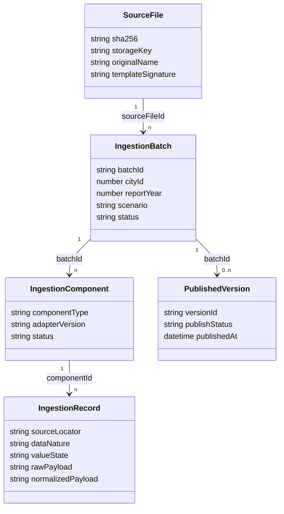

# 经营数据中台设计

> 状态：当前权威业务与数据设计  
> 对应需求：`specs/operating-data-platform/requirements.md`  
> 生效日期：2026-07-25

## 1. 设计原则

1. 模块化单体优先：先稳定业务边界、数据语义和发布协议，不以概念升级推动基础设施扩张。
2. 原始证据不可变：标准化、发布和指标计算都不能破坏来源文件及其定位信息。
3. 批次驱动：所有写入先进入批次，页面和外部来源不得直接代表正式数据。
4. 语义先于表结构：实际/预测/假设/派生、空白/零、单位和期间是强制字段，不靠命名约定猜测。
5. 发布版本化：正式数据通过发布版本生效，历史版本可追溯，不做无证据覆盖。
6. 适配器可替换：模板解析只负责把来源转成统一记录，不负责业务发布。

## 2. 总体流程


批次状态建议：

```text
received -> fingerprinted -> parsing -> normalized -> validating
         -> ready_to_publish -> publishing -> published
                                      |            |
                                      v            v
                                   failed       superseded

任意非终态 -> cancelled
```

状态转换由应用用例控制，数据库字段和前端标签只展示状态，不自行推进状态。

## 3. 经营测算包

一个文件对应一个根批次，根批次下包含多个子数据集：

| 子数据集 | 主要内容 | 目标数据性质 | 发布对象 |
| --- | --- | --- | --- |
| `contract_plan` | 合同信息、累计值、年度预测、经营假设 | master proposal / forecast / assumption / derived | 合同映射、地市年度计划 |
| `contract_monthly` | 合同×月份完工、审定及扩展指标 | actual 或 forecast，由字段和场景确定 | 合同月度值 |
| `cost_plan` | 成本类别×月份金额 | forecast 或 actual | 地市成本月度值 |
| `workforce_driver` | 发薪人数等驱动 | actual / forecast | 地市月度驱动值 |
| `maintenance_snapshot` | 合同期间累计开票及有效月份 | actual / derived | 综合代维合同期间快照 |

子数据集各自解析和校验，根批次统一预览。第一阶段整包原子发布；若未来允许部分发布，必须为每个已选组件创建独立发布版本并记录未发布组件。

## 4. 概念数据模型



### 4.1 接入与治理实体

| 建议实体 | 职责 | 关键约束 |
| --- | --- | --- |
| `source_files` | 文件元数据和对象存储引用 | `sha256` 可检索；不以 Base64 作为长期存储 |
| `ingestion_batches` | 根批次及认证归属 | 绑定 operator/city/year/scenario；状态受控 |
| `ingestion_components` | 子数据集状态和适配器版本 | `batch_id + component_type` 唯一 |
| `ingestion_records` | 行级原始和标准化载荷 | 保存 sheet/row/cell locator；不可覆盖原始载荷 |
| `quality_issues` | 阻塞、警告和处置记录 | 关联 batch/component/record；保存处理人和结果 |
| `lineage_events` | 接收、转换、发布和撤销血缘 | 只追加；关联来源和目标版本 |

### 4.2 主数据与业务资产

| 建议实体 | 业务键 | 说明 |
| --- | --- | --- |
| `contract_aliases` | alias_type + alias_value + city_scope | 映射组合编码、历史编码和名称别名 |
| `contract_city_plan_versions` | allocation + year + scenario + version | 替代固定 `_2026` 字段，保存年度预测和假设 |
| `contract_month_values` | contract + city + year + month + metric + nature + version | 用 metric 行表达完工、审定、订单、开票等 |
| `city_cost_month_values` | city + year + month + category + nature + version | 成本类别月度值 |
| `city_driver_month_values` | city + year + month + driver + nature + version | 人数等非金额驱动 |
| `maintenance_contract_snapshots` | contract + city + year + as_of_month + version | 合同级累计开票和有效月份，不压成地市包级单行 |
| `metric_definitions` | metric_code + version | 公式、单位、输入、舍入、适用期间和状态 |
| `published_snapshots` | city + year + scenario + publish_version | 正式版本入口和摘要，不复制原始证据 |

以上为目标语义模型。实施前必须用增量 DDL 设计确认字段、索引、外键和兼容视图；本设计不授权直接建表。

## 5. 值、单位和期间模型

每个标准数值至少包含：

- `raw_value`：来源原文或原始数值。
- `normalized_value`：标准化数值，可空。
- `value_state`：`missing`、`reported_zero`、`reported_value`、`derived_zero`、`not_applicable`、`parse_error`。
- `data_nature`：`actual`、`forecast`、`assumption`、`derived`。
- `raw_unit`、`normalized_unit`、`scale_factor`。
- `report_year`、可选 `month_no`、`as_of_month`、`effective_month_count`。
- `scenario`：例如 `actual`、`base_forecast`、`management_adjusted`。
- `source_locator` 和 `transformation_rule_version`。

数据库默认值不能代替值状态。服务端计算必须拒绝单位不兼容、期间不明确或解析失败的输入。

## 6. 模板适配器

适配器接口概念：

```ts
interface SourceAdapter {
  supports(signature: TemplateSignature): boolean;
  parse(input: SourceFileRef, context: BatchContext): ParsedComponent[];
}
```

适配器输出统一的组件、原始记录、标准候选记录和结构问题，不调用业务 repository，不发布数据。

首个模板适配器必须：

1. 识别四张核心工作表和表头签名。
2. 保留共享公式、缓存值、原始日期、组合费率和来源定位。
3. 把 `合同转化测算` 拆成主数据提案、年度计划、假设和派生对账值。
4. 把合同月度的两个指标分别解析，空白保持空白。
5. 把成本金额与人员驱动分开。
6. 从综合代维读取合同、累计值和显式截止期；截止期无法确定时生成阻塞问题。

模板版本通过工作表集合、表头签名、关键合并区域和规范版本共同识别，不仅依赖工作表名称包含关系。

## 7. 标准化和质量规则

### 7.1 合同映射

匹配顺序：已确认别名 -> 精确标准编码 -> 规范化编码候选 -> 名称和地市候选 -> 人工确认。行号对齐只能用于来源内部对账，不能成为正式主数据键。

### 7.2 阻塞问题

- 未知模板或缺少关键工作表。
- 地市与认证上下文不一致。
- 合同未映射或映射冲突。
- 数值字段出现无法解释的占位符。
- 年累计与月度合计不一致且无已批准调整。
- 单位、年度、截止月份或数据性质无法确定。
- 孤立记录缺少业务键。

### 7.3 警告问题

- 合同名称与主数据存在可解释差异。
- 暂定、未订或复合费率尚未形成结构化规则。
- 来源公式值与中台计算存在舍入范围内差异。
- 来源包含未来月份但未声明预测场景。

质量问题处理必须记录 `resolution_type`、说明、处理人、时间和影响记录；忽略警告不能改变阻塞规则。

## 8. 差异预览与发布

预览以目标业务键和字段为单位返回：

- `insert`：目标版本无对应记录。
- `update`：值或语义发生变化。
- `unchanged`：标准化后相同。
- `delete_risk`：来源缺少既有记录，但本批次默认不自动删除。
- `mapping_required`：需要主数据确认。
- `blocked`：质量问题阻止发布。

发布用例步骤：

1. 锁定批次并复验状态、权限、文件哈希和质量问题。
2. 生成新的发布版本号。
3. 在事务内写入版本化业务值、发布快照和血缘事件。
4. 记录幂等键和结果摘要。
5. 提交后使该版本可见，并将旧版本标记为 `superseded`，不删除旧值。

## 9. API 边界

建议以资源语义收敛为：

```text
POST   /api/ingestion-batches
GET    /api/ingestion-batches/:batchId
POST   /api/ingestion-batches/:batchId/parse
GET    /api/ingestion-batches/:batchId/preview
POST   /api/ingestion-batches/:batchId/publish
POST   /api/ingestion-batches/:batchId/cancel
GET    /api/quality-issues
POST   /api/quality-issues/:issueId/resolve
GET    /api/published-versions
GET    /api/lineage/:targetType/:targetId
```

创建批次时接收文件、年度和场景；地市和操作者从认证上下文绑定。其余接口仅接收 `batchId` 和动作所需的明确确认，不允许重传归属覆盖批次。

## 10. 权限与审计

- `city_user`：创建和查看自身地市批次，处理允许的警告，发布自身地市草稿版本。
- `system_admin`：跨地市查看、确认主数据映射、处理高风险质量问题、撤销或批准迁移。
- 只读消费者：只能读取已发布版本和权限过滤后的数据服务。

所有关键动作记录 actor、role、city、batch、component、source file、target version、reason、request context 和结果。审计失败时，高风险写操作不得假装成功。

## 11. 现有模型迁移

1. 基线：冻结当前表、路由、字段语义和真实样本输出，不以旧 tasks 作为证据。
2. 影子：新增接入和治理表，旧写路径不变；新适配器只解析、校验和对账。
3. 并行：新批次产生标准候选记录，与现有 `report_*` 和 dashboard 输出做差异报告。
4. 切换：经确认后，统一发布用例写目标版本表，并通过兼容查询供旧页面读取。
5. 退役：监控期内无旧调用且回归通过后，移除旧地市导入写入口；历史记录保留。

现有 `import_jobs` 可作为迁移来源或兼容映射，但不默认等同于目标根批次；`source_file_base64` 仅保留过渡读取能力，新文件进入对象存储。

## 12. 测试策略

- 适配器契约：模板签名、共享公式、混合日期、组合费率、空白/零、异常行。
- 领域单元：值状态、单位转换、期间、合同映射、指标版本和状态机。
- 数据质量：累计对账、孤立行、占位符、单位数量级和未知模板。
- 应用集成：创建、解析、预览、幂等发布、回滚、事务失败和并发确认。
- 权限：跨用户、跨地市、管理员审计和只读消费者。
- 迁移回归：新旧解析和业务输出按样本逐字段对账。
- 端到端：真实认证会话下的上传、问题处理、发布和查询；生产验证另行授权。

## 13. 需求追踪

| 设计章节 | 对应需求 |
| --- | --- |
| 2-3 根批次和测算包 | OP-R2 |
| 4-6 数据模型和值语义 | OP-R3、OP-R4、OP-R5 |
| 7 质量规则 | OP-R6 |
| 8 发布版本 | OP-R7 |
| 9-10 API、权限和审计 | OP-R8、OP-R9 |
| 11-12 迁移和测试 | OP-R1、OP-R10 |

