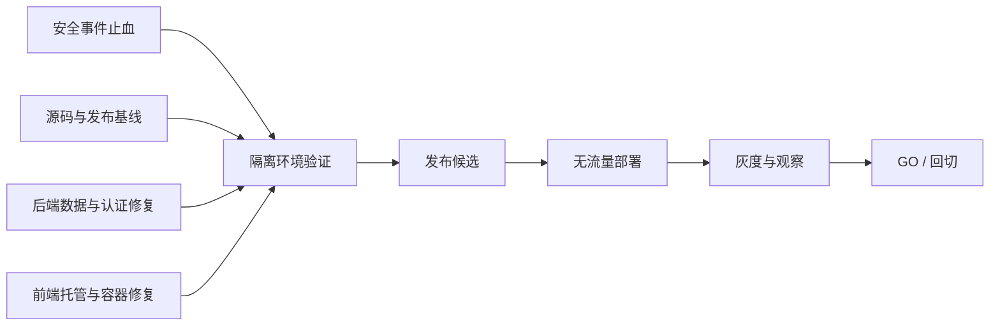

# 已部署项目全量治理技术设计

> 规格编号：PG-20260802  
> 状态：`DESIGN_APPROVED`  
> 用户确认：2026-08-02 经总治理负责人 Codex 与项目所有者批准，三方治理机制（最终授权人 / Codex / WorkBuddy）生效；安全止血优先于短时可用性。  
> 日期：2026-08-02  
> 上位需求：`requirements.md`  
> 已确认决策：三方治理机制生效；JWT 轮换采用强制全员重新登录；安全止血优先于短时可用性。  
> 本文件效力：定义代码与平台变更方案，不授权 WorkBuddy 修改代码、执行 Git 写操作或变更生产资源。

## 1. 设计结论

治理采用四条相互独立、按门禁汇合的路径：



关键决策：

1. 公网暴露先作为安全事件处理，证据保全后阻断匿名读取；代码修复不能替代云权限止血。
2. 现有 003 只作为 `KNOWN_BAD_REFERENCE`，不作为回滚版本。
3. 当前工作区不得整体提交；发布候选必须从精确 pathspec 组成的干净提交构建。
4. 现有 API 的鉴权流式导出保留；不再生成长期公开对象 URL。
5. WS6 导入从 Base64 数据库存储切到已有内容寻址持久存储，并保持旧字段只读兼容窗口。
6. WS6 采用“原子认领 processing 状态 + 业务事务全批回滚 + 受控重试”，禁止部分成功后标记失败。
7. 前端保留 `HashRouter`；500 的修复点是构建部署目录、根站入口和 CloudBase 网站文档，不改为 History Router。
8. 登录同时使用 IP 级 `@nestjs/throttler` 和账号标识哈希桶；安全事件写独立审计表，不记录原始用户名、IP、openid、微信 code 或邀请 token。
9. JWT 直接轮换单密钥，所有旧 JWT 立即失效；不实现双密钥兼容。
10. “不可绕过”由发布角色 IAM 收权实现：WorkBuddy 无部署和生产写权限，只有发布角色能执行最终变更。

## 2. 阶段与依赖

| 阶段 | 内容 | 前置条件 | 结束门禁 |
|---|---|---|---|
| S0 | 事件证据与止血 | 单独生产授权 | 匿名访问失败，证据清单完成 |
| S1 | 线上与源码基线 | S0 可并行 | 五段映射表完成，工作区分类完成 |
| S2 | 回归测试先行 | 需求和设计批准 | 旧代码能稳定复现对应失败 |
| S3 | 后端修复 | S1、S2 | 静态、单元、隔离 MySQL、存储测试通过 |
| S4 | 前端/托管/容器 | S1、S2 | 构建、浏览器、容器测试通过 |
| S5 | 发布候选 | S3、S4 | 完整门禁 PASS、镜像和托管 digest 完成 |
| S6 | 无流量部署与回切演练 | 单独部署授权 | 新旧版本均可运行，回切通过 |
| S7 | 灰度和观察 | 单独切流授权 | 指标达标或回切完成 |

S0 的权限止血可以在代码设计批准前单独授权，但必须回填证据。S3-S7 不得跨级。

## 3. 安全事件止血设计

### 3.1 只读基线

WorkBuddy 在任何写操作前，通过 CloudBase MCP 或经批准的控制台只读查询完成：

- 显式绑定 `EnvId=zy-data-d2g9g1ghr47ac6254`。
- 记录桶标识摘要、桶 ACL、对象级 ACL、CDN 状态、网站托管资源是否同桶。
- 记录 `exports/` 下对象数量、key 摘要、大小、创建/修改时间、ETag 和 SHA-256。
- 记录 NoSQL `audit_logs`、`submissions` 的集合权限、记录数和字段分类，不导出真实值到 Git。
- 检查 CLS/COS/CDN 日志是否启用，冻结与事件时间窗有关的日志保留策略。

原始证据放在受控、加密、非 Git 位置；仓库只保存脱敏摘要：

```text
evidence/incident-20260802-redacted/
  resource-baseline.json
  object-inventory-summary.json
  access-log-query-summary.json
  containment-verification.json
```

仓库摘要只允许保存资源摘要、计数、hash、时间、状态和请求 ID，不得保存姓名、openid、完整对象 URL 或签名参数。

### 3.2 止血顺序

1. 暂停产生新的审计 CSV/XLSX 公网对象；如果来源无法确定，先冻结相关导出任务或前缀写入。
2. 将敏感 NoSQL 集合改为仅服务端/管理员可读。
3. 若桶不承载合法公开资源，整桶改私有；若混放，则先对敏感对象/前缀阻断读取并创建独立私有存储迁移计划。
4. 失效 CDN 缓存和已知长期 URL。
5. 使用无 Cookie、无 Authorization 的独立客户端复测旧 URL，预期为 401/403/404，绝不能是 200。
6. 使用授权 API 验证合法导出仍受 RBAC 和地市范围控制。
7. 完成日志与影响范围核查后，历史对象先隔离再删除；删除必须再次单独授权。

### 3.3 停止条件

- 发现桶同时承载不可中断的公开资源，且平台不支持对象级临时阻断。
- 无法保全访问日志或对象清单。
- 目标环境、桶或集合与报告不一致。
- 权限修改后旧 URL 仍返回 200。

发生上述任一情况，WorkBuddy 停止并提交偏差单；安全优先授权允许短时关闭整个暴露面，但不能自行扩大范围。

## 4. 发布基线与权限治理

### 4.1 五段映射

新增 `scripts/release/capture-governance-baseline.mjs`，只读生成以下结构：

```ts
interface GovernanceBaseline {
  capturedAt: string;
  envId: 'zy-data-d2g9g1ghr47ac6254';
  git: { commit: string; porcelainSha256: string; clean: boolean };
  manifest: { version: string; digest: string };
  image: { digest: string | null; cloudRunVersion: string | null };
  hosting: { releaseId: string | null; contentDigest: string | null };
  migrations: { appliedVersions: string[]; ledgerDigest: string | null };
}
```

脚本不读取或输出环境变量值；云端字段由已经脱敏的只读查询结果文件输入。输出进入 `evidence/baselines/<timestamp>.json`。

### 4.2 发布清单

修改 `specs/rbac-auth-export-settings/release-manifest.json`：

- 版本改为 `production-governance-2026-08-02`。
- 加入 `specs/production-governance-20260802`。
- 加入本设计列出的新 migration、security、test、release 文件。
- 删除任何备份、`analysis-output`、本地数据库、构建目录和事故原始证据路径。

修改 `scripts/release/check-release-integrity.mjs`：

- 除必需文件的 dirty/untracked 外，新增对删除文件和大小异常文件的单独报告。
- 输出 `commit`、manifest digest、文件数，不输出文件内容。
- `--gate` 在 dirty、untracked、missing、checksum 漂移任一存在时退出 2。

新增 `scripts/release/check-governance-gates.mjs`：

```ts
const requiredEvidence = [
  'incident-containment.json',
  'source-baseline.json',
  'mysql.json',
  'storage.json',
  'browser.json',
  'container.json',
  'rollback.json',
];
```

每份证据必须满足：

```ts
interface GateEvidence {
  status: 'PASS';
  environment: 'isolated' | 'production-readonly' | 'production-approved';
  commit: string;
  manifestDigest: string;
  command: string;
  startedAt: string;
  finishedAt: string;
  reviewer: 'codex';
}
```

证据的 `commit`、`manifestDigest` 与当前候选不一致即失败。

### 4.3 IAM 强制约束

- WorkBuddy 执行身份：只读生产状态；可写本地工作区和隔离测试资源；无生产 COS/NoSQL/CloudRun/Hosting/Secret 写权限。
- 事故止血身份：仅在授权窗口获得指定桶、集合和 CDN 操作权限，窗口后撤销。
- 发布身份：只有运行完整门禁后才能部署 CloudRun/Hosting；不能改数据库内容。
- 数据库迁移身份：只允许目标 schema DDL/DML；无实例销毁、生产默认 schema 或 root 权限。

如果所有执行人仍共享管理员凭据，则“不可违背”无法技术实现，发布门禁必须保持 `BLOCKED`。

## 5. 依赖与 API 安全设计

### 5.1 依赖变更

修改 `apps/api/package.json`：

```json
{
  "dependencies": {
    "@nestjs/throttler": "6.5.0",
    "helmet": "8.3.0",
    "xlsx": "https://cdn.sheetjs.com/xlsx-0.20.3/xlsx-0.20.3.tgz"
  },
  "scripts": {
    "lint:check": "eslint \"{src,apps,libs,test}/**/*.ts\" --max-warnings 0"
  }
}
```

删除原 `xlsx:^0.18.5`，更新 `pnpm-lock.yaml`。Admin Web 同样把 `xlsx` 改为 SheetJS 官方 0.20.3 tarball，避免两个运行面继续携带旧版本。执行时必须运行 `pnpm audit --prod` 并保存结果；发现新高危项时停止，不得盲目强制升级。

### 5.2 `apps/api/src/main.ts`

新增 Helmet、可信代理和精确 CORS：

```ts
import helmet from 'helmet';

const app = await NestFactory.create(AppModule, { bufferLogs: true });
const express = app.getHttpAdapter().getInstance();
express.disable('x-powered-by');
express.set('trust proxy', Number(process.env.TRUST_PROXY_HOPS));
app.use(helmet({
  contentSecurityPolicy: false,
  crossOriginResourcePolicy: { policy: 'cross-origin' },
}));
```

约束：

- 生产必须显式配置 `TRUST_PROXY_HOPS`，只接受 1-3 的整数。
- `CORS_ORIGINS` 继续只接受精确 HTTPS origin；origin 不包含 `/dataofearth/` 路径。
- 保留 `enableShutdownHooks()`、全局 ValidationPipe 和生产禁用 Swagger。
- Helmet 必须在 CORS 和路由前注册。

### 5.3 `apps/api/src/runtime.config.ts`

新增生产必填验证：

```text
TRUST_PROXY_HOPS=1..3
AUTH_RATE_LIMIT_WINDOW_MS=60000
AUTH_RATE_LIMIT_IP_MAX=5
AUTH_ACCOUNT_WINDOW_MS=900000
AUTH_ACCOUNT_MAX_FAILURES=5
AUTH_ACCOUNT_BLOCK_MS=900000
AUTH_SECURITY_HMAC_KEY=<独立密钥，不能等于 JWT_SECRET>
JWT_ISSUER=biz-reporting-api
JWT_AUDIENCE=biz-reporting-clients
READINESS_CACHE_MS=5000
READINESS_TIMEOUT_MS=2000
```

新增 `requiredDistinctSecret(config, 'AUTH_SECURITY_HMAC_KEY', 'JWT_SECRET')`；日志只输出稳定错误码，不输出值。

### 5.4 `apps/api/src/app.module.ts`

引入：

```ts
ThrottlerModule.forRoot([{
  name: 'default',
  ttl: 60_000,
  limit: 120,
}])
```

全局 guard 顺序固定为：

```ts
{ provide: APP_GUARD, useClass: ThrottlerGuard },
{ provide: APP_GUARD, useClass: JwtAuthGuard },
{ provide: APP_GUARD, useClass: PermissionsGuard },
{ provide: APP_GUARD, useClass: RolesGuard },
```

同时将 TypeORM 配置中的 `as any` 改为精确 `TypeOrmModuleOptions` 分支，禁止新增类型逃逸。

## 6. 登录保护、审计和 JWT 设计

### 6.1 新数据表

新增 `apps/api/migration/009_production_governance.sql`，只做向前兼容扩展：

```sql
ALTER TABLE import_jobs
  ADD COLUMN source_file_storage_key VARCHAR(500) NULL AFTER source_file_url,
  ADD COLUMN source_file_sha256 VARCHAR(64) NULL AFTER source_file_storage_key,
  ADD COLUMN source_file_size BIGINT NULL AFTER source_file_sha256,
  ADD COLUMN source_file_stored_at DATETIME NULL AFTER source_file_size,
  ADD COLUMN attempt_count INT NOT NULL DEFAULT 0 AFTER status,
  ADD COLUMN processing_started_at DATETIME NULL AFTER attempt_count,
  ADD COLUMN failure_code VARCHAR(64) NULL AFTER processing_started_at;

CREATE INDEX idx_import_jobs_status_started
  ON import_jobs (status, processing_started_at);
CREATE INDEX idx_import_jobs_storage_key
  ON import_jobs (source_file_storage_key);

CREATE TABLE auth_login_rate_limits (
  id BIGINT PRIMARY KEY AUTO_INCREMENT,
  route_key VARCHAR(32) NOT NULL,
  subject_hash VARCHAR(64) NOT NULL,
  window_started_at DATETIME NOT NULL,
  attempt_count INT NOT NULL DEFAULT 0,
  blocked_until DATETIME NULL,
  updated_at DATETIME NOT NULL DEFAULT CURRENT_TIMESTAMP ON UPDATE CURRENT_TIMESTAMP,
  UNIQUE KEY uk_auth_rate_route_subject (route_key, subject_hash),
  KEY idx_auth_rate_blocked (blocked_until)
) ENGINE=InnoDB DEFAULT CHARSET=utf8mb4 COLLATE=utf8mb4_unicode_ci;

CREATE TABLE auth_security_events (
  id BIGINT PRIMARY KEY AUTO_INCREMENT,
  event_type VARCHAR(32) NOT NULL,
  outcome VARCHAR(16) NOT NULL,
  route_key VARCHAR(32) NOT NULL,
  subject_hash VARCHAR(64) NOT NULL,
  ip_hash VARCHAR(64) NOT NULL,
  user_id BIGINT NULL,
  city_id BIGINT NULL,
  reason_code VARCHAR(64) NOT NULL,
  request_id VARCHAR(64) NOT NULL,
  created_at DATETIME NOT NULL DEFAULT CURRENT_TIMESTAMP,
  KEY idx_auth_event_created (created_at),
  KEY idx_auth_event_subject (subject_hash, created_at),
  KEY idx_auth_event_ip (ip_hash, created_at)
) ENGINE=InnoDB DEFAULT CHARSET=utf8mb4 COLLATE=utf8mb4_unicode_ci;
```

不为 security event 的 `user_id` 建外键：不存在账号的失败尝试也必须可记录。`source_file_base64` 暂不删除，只改为默认不查询。

修改 `scripts/db/migrate.mjs`：

- 增加 009 的 SQLite 等价建表/加列函数。
- `inspectState('009_production_governance')` 检查全部列、表和索引。
- `check-files` required 列表加入 009。
- 更新 `scripts/db/migration-checksums.json`，不得改写 001-008 checksum。

### 6.2 新实体

新增：

- `apps/api/src/auth/auth-login-rate-limit.entity.ts`
- `apps/api/src/auth/auth-security-event.entity.ts`

字段逐一映射 009，JSON 和边界值使用 `unknown`，不得使用 `any`。

### 6.3 `LoginSecurityService`

新增 `apps/api/src/auth/login-security.service.ts`：

```ts
export type LoginRouteKey = 'admin_login' | 'city_login' | 'wechat_login' | 'wechat_bind';

export interface LoginSecurityContext {
  ip: string;
  requestId: string;
}

export interface LoginAuditDetails {
  route: LoginRouteKey;
  subject: string;
  context: LoginSecurityContext;
  outcome: 'success' | 'failed' | 'blocked';
  reasonCode: string;
  userId?: number | null;
  cityId?: number | null;
}

export class LoginSecurityService {
  assertAllowed(route: LoginRouteKey, subject: string): Promise<void>;
  recordFailure(details: LoginAuditDetails): Promise<void>;
  recordSuccess(details: LoginAuditDetails): Promise<void>;
  recordBlocked(details: LoginAuditDetails): Promise<void>;
}
```

实现规则：

- `subject_hash = HMAC-SHA256(AUTH_SECURITY_HMAC_KEY, route + '\0' + normalizedSubject)`。
- `ip_hash = HMAC-SHA256(AUTH_SECURITY_HMAC_KEY, 'ip\0' + normalizedIp)`。
- 原始 subject/IP 只在当前请求内存中存在，不写库、不写日志。
- `assertAllowed` 与 `recordFailure` 使用数据库事务和 `pessimistic_write` 锁定哈希桶。
- 超过 15 分钟窗口先清零；第 5 次失败设置 `blocked_until=now+15m`。
- 成功后将桶计数归零但保留审计事件。
- 审计表写入失败时登录失败关闭，返回 503 稳定错误码；不得静默跳过安全审计。

### 6.4 `apps/api/src/auth/auth.controller.ts`

四个公开端点增加 IP 限流：

```ts
@Throttle({ default: { limit: 5, ttl: 60_000 } })
```

控制器从可信代理处理后的 `req.ip` 和 `X-Request-Id` 构造 `LoginSecurityContext`，传给 AuthService。DTO 不再只使用 shared interface；新增本地 class DTO 并用 class-validator 验证长度：

- username：1-100。
- password：8-128，不 trim 密码。
- WeChat code：1-256。
- invitationToken：32-512。

shared types 保留为响应和跨端静态契约，本地 class 实现对应 interface。

### 6.5 `apps/api/src/auth/auth.service.ts`

四个登录方法增加 context 参数。管理员/地市密码登录固定流程：

```text
normalize subject
-> assertAllowed
-> 查询账号（不存在时执行固定 dummy bcrypt compare）
-> 校验状态、角色、密码
-> 失败：recordFailure + 通用 401
-> 成功：清桶、更新 last_login_at、写 success event、签发 JWT
```

所有失败对外使用通用文案；内部 `reason_code` 使用枚举，如 `USER_NOT_FOUND`、`PASSWORD_MISMATCH`、`ROLE_MISMATCH`、`ACCOUNT_DISABLED`、`ACCOUNT_RATE_BLOCKED`。

微信登录：IP 由 Throttler 控制；code2session 成功后以 openid 的 HMAC 作为 subject，绝不保存原始 code。微信绑定以 invitation token 的 HMAC 作为调用前 subject，绑定成功后写用户 ID。

### 6.6 JWT 强制轮换

修改 `auth.module.ts` 与 `jwt.strategy.ts`：签发和验证都设置同一 `issuer`、`audience`。发布维护窗口按以下顺序：

1. 在受控密钥管理中创建新 JWT secret 和新 DB 密码。
2. 用新 DB 凭据做隔离连接验证。
3. 部署无流量新版本，注入新 JWT secret、新 DB 密码和 `JWT_SECRET_VERSION`，不输出值。
4. 验证新版本登录与权限。
5. 切流后旧 JWT 在新版本全部返回 401，前端清 token 跳转登录。
6. 撤销旧 DB 密码，确认连接池已重建。
7. 删除旧 JWT secret 的部署引用。

不增加旧密钥验证路径。`authVersion` 继续用于账号级撤销，不承担全局密钥轮换。

## 7. WS6 文件、权限与事务设计

### 7.1 上传配置复用

新增 `apps/api/src/ws6/import-upload.config.ts`：

```ts
export const IMPORT_MAX_BYTES = 10 * 1024 * 1024;
export const IMPORT_ALLOWED_EXTENSIONS = new Set(['.xlsx', '.xls', '.csv']);

export const importUploadOptions: MulterOptions = {
  storage: memoryStorage(),
  limits: { files: 1, fileSize: IMPORT_MAX_BYTES },
  fileFilter: (_request, file, callback) => {
    const extension = extname(decodeUploadName(file.originalname)).toLowerCase();
    callback(
      extension && IMPORT_ALLOWED_EXTENSIONS.has(extension)
        ? null
        : new BadRequestException('仅支持 xlsx、xls 或 csv 文件'),
      IMPORT_ALLOWED_EXTENSIONS.has(extension),
    );
  },
};
```

四个上传控制器统一引用该配置，并把 `sourceFileBase64` 改为 `sourceFileBuffer: file.buffer`。旧 deprecated 控制器在确认无调用后单独移除；治理期间先保持兼容。

### 7.2 `ImportJobEntity`

修改 `apps/api/src/ws6/import-job.entity.ts`：

```ts
@Column({ name: 'source_file_base64', type: 'text', nullable: true, select: false })
sourceFileBase64: string | null;

@Column({ name: 'source_file_storage_key', type: 'varchar', length: 500, nullable: true })
sourceFileStorageKey: string | null;
@Column({ name: 'source_file_sha256', type: 'varchar', length: 64, nullable: true })
sourceFileSha256: string | null;
@Column({ name: 'source_file_size', type: 'bigint', nullable: true })
sourceFileSize: number | null;
@Column({ name: 'source_file_stored_at', type: 'datetime', nullable: true })
sourceFileStoredAt: Date | null;
@Column({ name: 'attempt_count', type: 'int', default: 0 })
attemptCount: number;
@Column({ name: 'processing_started_at', type: 'datetime', nullable: true })
processingStartedAt: Date | null;
@Column({ name: 'failure_code', type: 'varchar', length: 64, nullable: true })
failureCode: string | null;
```

### 7.3 创建与读取源文件

`Ws6Module` 导入 `FactsModule`，`Ws6Service` 注入现有 `FactSourceFileStorageService`。

`createImportJob` 输入改为：

```ts
interface CreateImportJobInput {
  jobType: SupportedImportJobType;
  operatorUserId: number;
  cityId: number | null;
  reportYear?: number | null;
  sourceFileName: string;
  sourceFileBuffer: Buffer;
}
```

执行顺序：计算 SHA-256 -> `sourceFiles.store()` -> 保存 storage metadata -> 保存 job。数据库不再写 Base64。

新增：

```ts
private async readSourceBuffer(job: ImportJobEntity): Promise<Buffer> {
  if (job.sourceFileStorageKey && job.sourceFileSha256) {
    const buffer = await this.sourceFiles.read(job.sourceFileStorageKey);
    const actual = createHash('sha256').update(buffer).digest('hex');
    if (actual !== job.sourceFileSha256) throw new InternalServerErrorException('IMPORT_SOURCE_HASH_MISMATCH');
    return buffer;
  }
  return this.readLegacySourceBuffer(job.id);
}
```

`readLegacySourceBuffer` 必须用独立 query builder 显式 `addSelect('job.sourceFileBase64')`，只允许预览、确认、下载和迁移调用；列表和详情绝不调用。

新增 `scripts/oneoff/migrate-import-job-files.mjs`：按 ID 游标读取旧 Base64，每批不超过 20 条，写持久存储、核 hash、更新 metadata；默认 `--dry-run`，必须显式 `--apply --env-id <full-id>` 才写。任何失败保留 Base64，不做清空。清空旧字段是观察期后的独立任务和独立授权。

### 7.4 列表查询

`listImportJobs` 的 query builder 立即增加显式 select：

```ts
.select([
  'job.id', 'job.jobType', 'job.operatorUserId', 'job.cityId',
  'job.reportYear', 'job.status', 'job.sourceFileName',
  'job.confirmedAt', 'job.createdAt', 'job.updatedAt',
])
```

数据库测试在插入 10MB Base64 后调用 pageSize=100，SQL 日志或结果对象必须证明未选择 `source_file_base64`；进程堆增长阈值设为小于 20MB。

### 7.5 权限修复

`assertImportJobAccess` 改为：

```ts
private assertImportJobAccess(job: ImportJobEntity, user: RequestUserScope): void {
  if (isSystemAdmin(user)) return;
  this.assertCityImportAccess(job, user);
}
```

这使已经存在但未调用的“operator + city + job type”复合校验真正生效。所有 detail、preview、confirm、cancel、source-file 路径继续只调用这一入口。

### 7.6 原子认领与并发控制

`confirmBoundImport` 拆成四步：

1. 读取 job、校验权限、执行 preview 和 overwrite 检查。
2. 原子认领：

```ts
const claim = await this.importJobRepo.createQueryBuilder()
  .update(ImportJobEntity)
  .set({
    status: JobStatus.PROCESSING,
    processingStartedAt: new Date(),
    attemptCount: () => 'attempt_count + 1',
    failureCode: null,
  })
  .where('id = :jobId', { jobId })
  .andWhere('status IN (:...claimable)', { claimable: [JobStatus.PENDING, JobStatus.PREVIEWED] })
  .execute();
```

3. `affected !== 1` 时重读：COMPLETED 返回 alreadyConfirmed；PROCESSING 返回 409；其他状态返回 400。
4. 执行业务事务；成功更新 COMPLETED，异常在事务外更新 FAILED、failureCode 和 errorSummary。

不使用长时间持有的 import_jobs 行锁包住 Excel 解析；原子状态更新负责并发互斥，业务写入由内部事务负责一致性。

### 7.7 全批回滚

在 `reporting-import.service.ts` 新增：

```ts
export class ReportingImportAtomicityError extends Error {
  constructor(readonly errors: readonly ImportErrorRow[]) {
    super('REPORTING_IMPORT_ATOMICITY_FAILED');
  }
}
```

事务循环仍可收集多条错误，但事务回调结束前必须：

```ts
if (errors.length > 0) {
  throw new ReportingImportAtomicityError([...errors]);
}
```

只有无错误才允许 transaction callback 返回。Ws6Service 捕获该类型，把 `errors` 写入 job 错误摘要；由于异常已经离开业务事务，之前写入全部回滚。

`contract-import.service.ts` 同样检查是否存在“收集错误后提交”的模式；若存在，使用同一异常语义，不能只修 reporting 分支。

### 7.8 失败重试

新增端点：

```text
POST /api/admin/import-jobs/:jobId/retry
POST /api/city/import-jobs/:jobId/retry
```

`retryImportJob` 只允许：

- 当前状态 FAILED。
- `source_file_storage_key` 与 hash 均存在。
- `failure_code` 位于允许重试白名单。
- `attempt_count < 3`。
- 当前用户通过复合访问校验。

原子更新 FAILED -> PENDING，清 `processing_started_at`、`failure_code`、错误摘要，不清源文件和历史审计。迁移前遗留 FAILED 且无 storage key 的任务标记 `LEGACY_REVIEW_REQUIRED`，不得自动重跑。

### 7.9 工作簿资源限制

所有 `XLSX.read()` 通过新 `apps/api/src/common/files/workbook-policy.ts` 封装：

```ts
export interface WorkbookPolicy {
  maxBytes: 10 * 1024 * 1024;
  maxSheets: 20;
  maxRowsPerSheet: 100_000;
  maxColumnsPerSheet: 200;
}
```

解析前检查 bytes，解析后立即检查 SheetNames 和每张表 `!ref` 范围；越限抛稳定 400 错误码。四处读取点不得直接调用 `XLSX.read()`。导出生成也设置最大行数 100,000，超过时拒绝同步生成。

## 8. 导出安全设计

当前 `ExportsController` 已要求 JWT、角色、权限，`getExportFile` 即时生成 buffer。因此治理后采用以下规则：

- 不在 COS 创建 `exports/audit_*.csv/xlsx`。
- `export_jobs.file_url` 只返回相对鉴权 API 路径，不保存公网 URL。
- 下载前检查 job 为 COMPLETED、未过期、operator/role/city scope 全部满足。
- `Content-Disposition: attachment`、`Cache-Control: no-store, private`。
- 每次下载成功、拒绝、过期或生成失败写 operation log，不写导出内容。
- 页面导出审计继续由服务端身份覆盖 scope，不信任客户端传入的 scopeLabel。

`getExportFile` 新增：

```ts
if (job.status !== JobStatus.COMPLETED) throw new ConflictException('EXPORT_NOT_READY');
if (!job.expiresAt || job.expiresAt.getTime() <= Date.now()) throw new GoneException('EXPORT_EXPIRED');
```

如果未来必须异步存储大导出，只能进入独立设计：私有对象、短时签名、一次性审计，不得复用静态托管公开桶。

## 9. 健康检查与可观测性

### 9.1 存储就绪

修改 `FactSourceFileStorageService`：

```ts
assertReadable(): Promise<void>; // 只做 R_OK
assertWritable(): Promise<void>; // 启动时做一次受控写探针
```

`onModuleInit` 执行 readable + writable；每次 `/ready` 只执行 readable。捕获文件系统错误用 `unknown` 和 `isNodeError` 类型守卫，删除现有 `catch (error: any)`。

### 9.2 `AppService`

- DB `SELECT 1` 和 storage readable 各有 2 秒超时。
- readiness 结果缓存 5 秒，避免公网请求放大后端 I/O。
- 失败只返回 `database:down` / `storage:down`，日志写 request ID 和稳定错误码，不输出连接信息。
- 删除空 `catch {}`，改为显式记录依赖状态。

### 9.3 请求关联

新增：

- `apps/api/src/common/http/request-id.middleware.ts`
- `apps/api/src/common/http/http-logging.interceptor.ts`

请求 ID 只接受 `[A-Za-z0-9._-]{1,64}`，否则生成 UUID；响应返回 `X-Request-Id`。结构化日志字段：method、route、status、durationMs、requestId、userId、cityId；禁止 body、Authorization、Cookie、openid、姓名和查询值。

### 9.4 平台监控

CLS 保留期从 7 天改为至少 90 天；事件相关日志按法务决定延长。告警阈值初始值：

| 指标 | 阈值 | 动作 |
|---|---|---|
| 5xx | 5 分钟 > 1% 或连续 5 次 | 停止扩流 |
| P95 | 5 分钟 > 1500ms | 暂停扩流并诊断 |
| 内存 | > 75% 持续 10 分钟 | 暂停；>85% 回切 |
| 认证失败 | 较基线 3 倍或 429 激增 | 安全告警 |
| 导入失败 | 任一 atomicity/hash 错误 | 停止导入 |
| 审计写失败 | 任一 | 认证相关操作失败关闭 |
| 存储 hash | 任一不一致 | 立即停止写入和下载 |

## 10. 前端与静态托管设计

### 10.1 路由判断修正

`apps/admin-web/src/App.tsx` 已使用 `HashRouter`，合法地址形态为：

```text
https://<hosting-origin>/dataofearth/#/login
https://<hosting-origin>/dataofearth/#/admin/dashboard
https://<hosting-origin>/dataofearth/#/city/upload
```

hash 后内容不会发送到服务器，因此不改 BrowserRouter，不为每个业务路径配置服务端 rewrite。

### 10.2 构建目录

保留 `vite.config.ts` 的 `base:'/dataofearth/'`，但新增常量和构建断言：构建后的 `dist/index.html` 中所有脚本/样式必须以 `/dataofearth/` 开头。

新增 `scripts/release/build-hosting-bundle.mjs`，生成：

```text
deploy-output/hosting/
  index.html                  # 只做 meta refresh/JS fallback 到 /dataofearth/
  dataofearth/
    index.html
    assets/...
```

根 `index.html` 不包含业务数据，只将根访问跳转到 `/dataofearth/`。发布时不能直接把 `dist` 上传到根目录，也不能只上传 assets。

### 10.3 网站文档

部署前使用 CloudBase MCP 完成并回读：

```text
indexDocument = index.html
errorDocument = index.html
```

由于应用使用 HashRouter，未知无 hash 路径回到根入口后跳转；业务 hash 路径直接命中 `/dataofearth/index.html`。若平台实际支持带路径 error document，可在偏差审批后使用 `dataofearth/index.html`，不得执行官自行猜测。

### 10.4 浏览器验证

新增 `apps/admin-web/e2e/hosting-routes.spec.ts` 和根 `playwright.config.ts`，至少验证：

- 根路径返回非 500 并进入 `/dataofearth/`。
- `/dataofearth/` 返回 200，资源无 404。
- 三个 hash 深链直接访问和刷新保持页面。
- 未登录进入 login，登录后回到 redirect。
- JWT 轮换后的 401 清 token 并跳转登录。
- CORS OPTIONS 只允许正式 origin，随机 origin 和 localhost 被拒绝。
- 页面无新增 console error、pageerror 和 failed request。

## 11. CloudRun 与 Docker 设计

根 `Dockerfile` 和 `apps/api/Dockerfile` 必须保持内容一致，或删除副本只保留一个权威 Dockerfile。优先保留根文件作为 CloudRun 构建入口。

runner 阶段改为：

```dockerfile
FROM node:20-alpine AS runner
RUN addgroup -S -g 10001 app && adduser -S -D -H -u 10001 -G app app \
 && mkdir -p /app /mnt/fact-source-files \
 && chown -R 10001:10001 /app /mnt/fact-source-files
WORKDIR /app
ENV NODE_ENV=production
ENV FACT_SOURCE_STORAGE_ROOT=/mnt/fact-source-files
COPY --from=builder --chown=10001:10001 /app/deploy ./
USER 10001:10001
HEALTHCHECK --interval=30s --timeout=5s --retries=3 \
  CMD wget -qO- http://localhost:${PORT:-3000}/api/health/live || exit 1
EXPOSE 3000
CMD ["node", "dist/main.js"]
```

部署前必须证明外部挂载对 UID/GID 10001 可读写；挂载覆盖镜像目录权限后若不可写，部署门禁失败，不能退回 root。

CloudRun 配置：Container mode、显式 `PORT`、MinNum 至少 1、MaxNum 由数据库连接预算计算，公网仅开放 API 必需入口。P0 阶段 `MaxNum` 固定为 1；只有在接入共享 ThrottlerStorage（支持多实例全局限流）并通过多实例验证后，才允许扩容。服务名统一为当前真实服务 `biz-reporting-api-v3-staging`，修改：

- `cloudbaserc.json`
- `apps/api/cloudbaserc.json`
- `scripts/deploy.js` 或其替代发布脚本
- README 和部署手册中的目标名称

正式生产服务必须使用单独配置文件和单独授权，不能把 staging 名称字符串替换后直接发布。

## 12. 测试设计

### 12.1 新测试文件

| 文件 | 覆盖 |
|---|---|
| `apps/api/test/login-security.test.cjs` | HMAC、不存明文、5 次锁定、窗口恢复、成功清零、并发失败 |
| `apps/api/test/auth-rate-limit.integration.mjs` | 公开登录端点 429、可信代理、未知账号通用响应 |
| `apps/api/test/reporting-import-atomicity.integration.mjs` | 首/中/末行错误全部回滚 |
| `apps/api/test/import-job-concurrency.integration.mjs` | 双 confirm 仅一次成功、PROCESSING 409 |
| `apps/api/test/import-job-storage.integration.mjs` | 内容寻址、hash、legacy fallback、迁移幂等 |
| `apps/api/test/import-job-list-memory.mjs` | 10MB Base64 不进入列表、内存阈值 |
| `apps/api/test/export-access.integration.mjs` | operator、city、expiry、no-store、审计 |
| `apps/api/test/security-headers.test.mjs` | Helmet、无 x-powered-by、CORS |
| `apps/api/test/readiness.test.mjs` | 只读 ready、超时、5 秒缓存、503 |
| `apps/admin-web/e2e/hosting-routes.spec.ts` | 根站、子目录、hash 路由、刷新、401、CORS |
| `scripts/test/check-container-runtime.mjs` | UID/GID、端口、health、挂载权限 |
| `scripts/test/check-governance-evidence.mjs` | evidence 与 commit/digest 绑定 |

### 12.2 必跑命令

```powershell
pnpm install --frozen-lockfile
pnpm --filter @biz-reporting/shared-types typecheck
pnpm --filter @biz-reporting/shared-types build
pnpm --filter @biz-reporting/api exec tsc --noEmit
pnpm --filter @biz-reporting/api lint:check
pnpm --filter @biz-reporting/api build
pnpm --filter @biz-reporting/admin-web exec tsc -b --pretty false
pnpm --filter @biz-reporting/admin-web lint
pnpm --filter @biz-reporting/admin-web build
node --test apps/api/test
node scripts/db/migrate.mjs check-files
pnpm test:migrations:mysql
pnpm test:storage-gate
pnpm test:deployment-preflight
pnpm test:architecture
pnpm release:integrity:gate
node scripts/release/check-governance-gates.mjs
pnpm exec playwright test apps/admin-web/e2e/hosting-routes.spec.ts
```

`pnpm install` 若需要网络必须单独批准。测试只能连接显式隔离 MySQL/存储；凭据缺失时门禁为 BLOCKED，不能回退 SQLite 或生产资源。

### 12.3 旧代码失败证据

每个修复任务开始前先在未修改基线运行对应测试，保存至少一个稳定失败：

- WS6 测试证明旧代码发生部分提交。
- 列表测试证明 SQL 包含 `source_file_base64`。
- 限流测试证明连续请求没有 429。
- 容器测试证明 UID=0。
- 托管测试证明根或目标路径返回 500。

没有旧代码失败证据时，不允许声称测试覆盖了原缺陷。

## 13. 发布与回滚设计

### 13.1 候选构建

1. 从批准的精确 pathspec 形成独立提交。
2. 运行全部本地与隔离门禁。
3. 从该 commit 构建镜像并记录 image digest。
4. 生成托管 bundle 并记录内容 digest。
5. 无流量部署新 CloudRun version，保留旧版本。
6. 只读核对配置名称和值来源；不得打印 secret value。

### 13.2 数据兼容

009 只加列和表，不删除 Base64，旧应用仍可运行；新应用优先 storage key、回退 Base64。因此应用可以回切而不 down migration。旧应用创建的 Base64 job 仍可被新应用读取；新应用创建的 storage-only job 不应由旧应用确认，所以回切后必须暂停导入功能，直到重新切回新版本。

### 13.3 灰度顺序

```text
0% 无流量验证
-> 内部测试流量
-> 5% / 15 分钟
-> 25% / 30 分钟
-> 50% / 30 分钟
-> 100% / 60 分钟观察
```

平台若不支持精确比例，则采用独立 staging 域名验证后一次切换；不得伪造灰度证据。

### 13.4 回切

- 只回切应用流量，不执行 down migration。
- 涉及错误写入时先关闭导入/导出写入口，再保全 requestId、jobId、版本、日志、数据库和文件 hash。
- 回切旧应用后保持导入暂停，因为旧应用不理解新 storage-only job。
- 数据修复通过新迁移、新版本或补偿操作，禁止覆盖历史迁移和批量手工改库。

## 14. WorkBuddy 执行边界

`tasks.md` 必须把本设计拆成单文件或单行为域任务。每项任务至少包含：

```text
任务编号 / 需求映射 / 负责人
允许修改的精确 pathspec
禁止修改路径
前置失败测试
代码步骤与接口签名
验证命令与预期输出
证据文件位置
Codex 验收状态
生产授权状态
失败回退与偏差单
```

WorkBuddy 不得：

- 同时修改共享鉴权、WS6 和发布脚本后一次性交付。
- 为通过门禁删除、跳过或放宽测试。
- 使用 `any`、忽略 TypeScript、空 catch 或宽泛权限作为临时方案。
- 自动提交、推送、部署或修改生产数据。
- 发现设计与代码不一致后自行改变接口。

## 15. 需求追踪

| 需求 | 设计章节 |
|---|---|
| PG-R1 | 3 |
| PG-R2 | 4.1-4.2 |
| PG-R3 | 4、13 |
| PG-R4 | 3、8 |
| PG-R5 | 5.3、6.6 |
| PG-R6 | 6.2-6.5 |
| PG-R7 | 7.5-7.8 |
| PG-R8 | 7.1-7.4 |
| PG-R9 | 10 |
| PG-R10 | 5、7.9、9、11 |
| PG-R11 | 12 |
| PG-R12 | 9、13.3 |
| PG-R13 | 14 |
| PG-R14 | 2、3.3、14 |

## 16. 设计确认门

批准本设计表示同意以下技术取舍：

1. WS6 使用已有持久存储服务，不新建第二套文件系统抽象。
2. 009 迁移保留旧 Base64 兼容，不在本轮自动删除历史字段。
3. 登录审计使用独立安全事件表，原始账号/IP/openid 不入库。
4. JWT 轮换强制所有用户重新登录。
5. 前端保留 HashRouter 和 `/dataofearth/`，通过发布 bundle 与网站文档修复 500。
6. 导出继续走鉴权 API，不创建长期对象 URL。
7. WorkBuddy 无生产写和部署权限；生产动作逐项单独授权。

设计批准后才能创建 `tasks.md`；设计批准本身仍不授权实现或生产变更。

